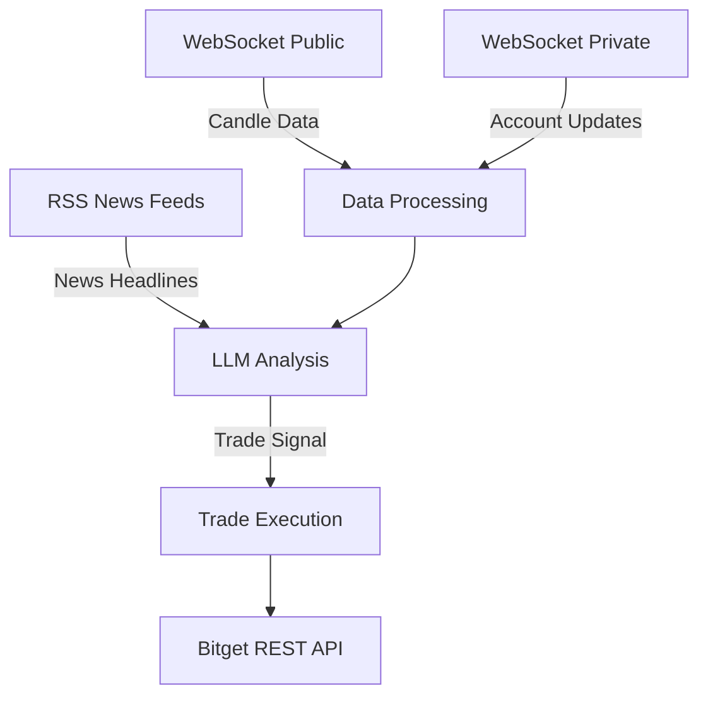

# Superior Agent 247 - AI-Powered Trading Bot

## Overview
An advanced trading bot for Bitget exchange that combines:
- Real-time market data analysis
- AI-driven decision making (via OpenRouter LLM)
- Automated trade execution

## Key Features
- **Real-time Data Processing**: WebSocket connections for market data and account updates
- **AI Analysis**: LLM-powered technical and sentiment analysis
- **Risk Management**: Configurable trade sizing and logging
- **Multi-threaded Architecture**: Async WebSocket handlers with sync callbacks
- **Comprehensive Logging**: Detailed trade history and error tracking

## Architecture


## Installation
```bash
# Clone repository
git clone https://github.com/Mingo-Kun/superior-agent-247.git
cd superior-agent-247

# Install dependencies
pip install -r requirements.txt
```

## Configuration
1. Create `.env` file:
```ini
BITGET_DEMO_API_KEY=your_api_key
BITGET_DEMO_API_SECRET=your_secret
BITGET_DEMO_API_PASSPHRASE=your_passphrase
OPENROUTER_API_KEY=your_openrouter_key
LLM_MODEL=deepseek/deepseek-chat-v3-0324:free
```

2. Adjust trading parameters in code:
- `TARGET_INSTRUMENT`: Trading pair (default: SBTCSUSDT)
- `CANDLE_CHANNEL`: Timeframe for analysis (default: 1h)
- `MAX_CANDLES`: Historical data storage
- `RSS_FEEDS`: News sources for sentiment analysis

## Usage
```python
python agent247.py
```

### Trading Cycle Workflow
1. Fetches latest news headlines
2. Collects real-time candle data
3. Performs LLM analysis combining:
   - Technical indicators (MA, EMA, BOLL, SAR)
   - Volume analysis (VOL, MACD)
   - Momentum indicators (KDJ, RSI, ROC, CCI, WR)
4. Executes trades based on signal confidence

## API Reference

### WebSocket Handlers
- `handle_private_message()`: Processes account/position updates
- `handle_public_message()`: Processes candle data updates

### Core Functions
- `fetch_news()`: Retrieves market news from RSS feeds
- `get_llm_analysis()`: Generates trade signals using AI
- `place_trade_via_rest()`: Executes trades via Bitget API

## Customization
To modify the trading strategy:
1. Adjust LLM prompt in `get_llm_analysis()`
2. Modify trade sizing logic in `run_trading_cycle()`
3. Add new technical indicators to analysis

## Monitoring
- Trade logs: `trade_history.json`
- System logs: `bot.log`

## Troubleshooting
- **WebSocket Issues**: Check API credentials and network connectivity
- **LLM Errors**: Verify OpenRouter API key and model availability
- **Trade Failures**: Review Bitget API response in logs

## Disclaimer
This is demo software for educational purposes only. Use at your own risk.